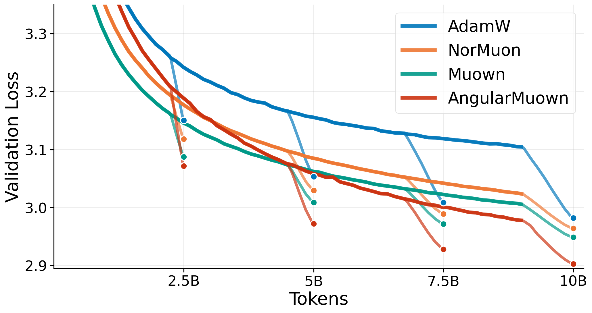
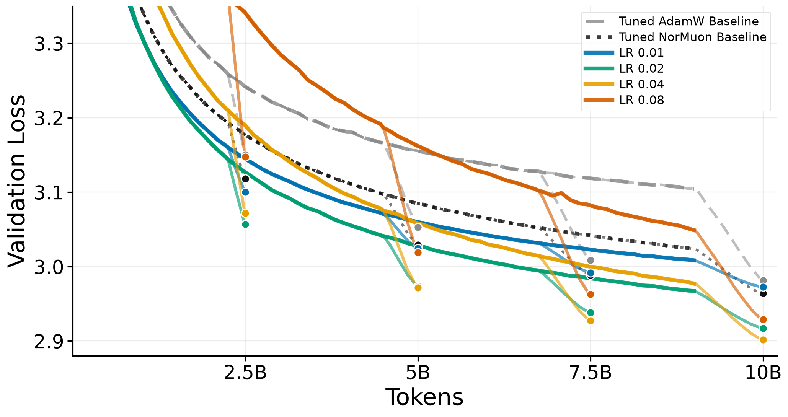
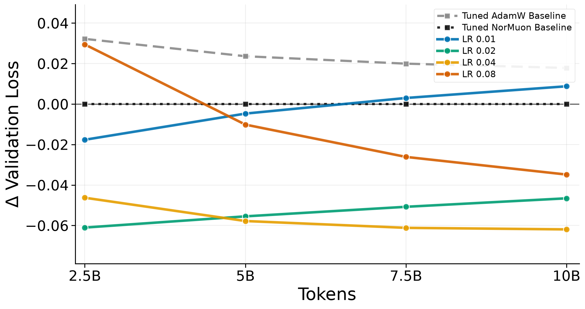

# AngularMuown

AngularMuown is a Muon-style optimizer for hidden weight matrices, designed as a practical drop-in replacement for Muon with optimizer-internal weight normalization and angular step-size decay. Compared with Muown, it adds no memory overhead and only row-wise extra computation. Technically, it removes the directional-row-norm gauge freedom of [Muown](https://github.com/kcc-lion/muown) by parametrising each weight matrix as

```math
W = \mathrm{Diag}(g)U, \qquad U \in \mathcal{OB}(m, n),
```

where $\mathcal{OB}(m, n)= \{A \in \mathbb{R}^{m \times n} \mid \lVert A_i \rVert_2 = 1 \text{ for all rows } A_i, i \in [m]\}$ is the row-oblique manifold. While the row-norm $g$ is updated with Adam, the direction $U$ is updated with Muon on the Oblique manifold, which allows us to explicitly control the angular stepsize. More precisely, with $G = \nabla_W F(W)$ and $G_i, U_i$ denoting the $i$-th rows of $G$ and $U$,

```math
\begin{aligned}
    \mathrm{grad}_{U} F(W)_i
    &= g_i\bigl(G_i - \langle G_i, U_i\rangle U_i\bigr),
    &&\text{Riemannian gradient on } \mathcal{OB}(m, n),\\
M
    &\gets \beta_1 M + \mathrm{grad}_{U} F(W),
    &&\text{momentum},\\
Q
    &\gets \mathrm{Polar}\bigl(\beta_1 M + \mathrm{grad}_{U} F(W)\bigr),
    &&\text{Muon w/ Nesterov momentum},\\
U
    &\gets \mathrm{RowNorm}\bigl(U - \eta \cdot \kappa \cdot s_{m,n} \cdot Q\bigr),
    &&\text{retraction}.
\end{aligned}
```

Here $\eta$ is the stepsize, $\kappa$ the angular stepsize multiplier, and by default $s_{m,n} = \sqrt{\max\lbrace 1, m/n \rbrace}$.

## Empirical Evidence

Following the Experimental setup from Muown, we use WSD and tune the lrs of AdamW, NorMuon and Muown across `lr = [0.001, 0.002, 0.004, 0.008, 0.016]` for pre-training a 124M Transformer on FineWeb-Edu. For AngularMuown we used `lr = 0.04` with the default optimizer-internal angular decay and shape scaling. More details and larger scale experiments can be found in the arXiv preprint.

<p align="center">
  
</p>

## Recommended Usage

Use AngularMuown for 2D hidden weight matrices only, and AdamW for embeddings, heads, biases, norms, and other non-hidden parameters. We recommend no weight decay on the AngularMuown parameters. If WSD is used, use the same WSD schedule for both optimizers, set `warmup_steps` in `AngularMuown` to the same warmup, and keep the default angular-decay parameters and shape scaling.

```python
import torch
from angular_muown import AngularMuown

max_lr = 0.04
warmup_steps = ...

angular_muown_params = [...]      # 2D hidden matrices only
adamw_params = [...]    # embeddings, heads, biases, norms, etc.

angular_muown = AngularMuown(angular_muown_params, lr=max_lr, warmup_steps=warmup_steps)
adamw = torch.optim.AdamW(adamw_params, lr=max_lr)

wsd_angular_muown_lr = WSDLRScheduler(angular_muown, max_lr=max_lr, warmup_steps=warmup_steps)
wsd_adamw_lr = WSDLRScheduler(adamw, max_lr=max_lr, warmup_steps=warmup_steps)

for batch in dataloader:
    angular_muown.zero_grad()
    adamw.zero_grad()

    loss = model(**batch).loss
    loss.backward()

    angular_muown.step()
    adamw.step()

    wsd_angular_muown_lr.step()
    wsd_adamw_lr.step()
```

The same `lr` can be used for AngularMuown and AdamW. Internally, `warmup_steps` keeps the angular multiplier at `1` during warmup. Afterwards the direction update receives an inverse-polynomial decay with defaults `decay_scale=0.001` and `decay_degree=1.0`; the row scale $g$ continues to follow the ordinary optimizer `lr`. If a cosine scheduler is used instead of WSD, disable angular decay by setting `decay_degree=0.0`.

## Tuning Notes

We recommend keeping the default angular decay and shape scaling, and tuning only the learning rate at first. In our experiments `max_lr` around `0.04` worked well. If tuning is possible, a conservative first grid is `max_lr = [0.04, 0.02, 0.01]`.

<table>
<tr>
<td width="50%">

<p><strong>Loss curves.</strong> Validation loss for the learning-rate sweep compared to tuned AdamW and NorMuon baselines.</p>
</td>
<td width="50%">

<p><strong>Final-loss differences.</strong> Validation loss differences relative to tuned NorMuon for the same sweep.</p>
</td>
</tr>
</table>

## References and Prior Work

AngularMuown builds on several lines of previous work. An incomplete list of important contributions includes the following.

#### Prior Public Disclosure

A preliminary version of AngularMuown was publicly disclosed in our [May 8th modded-nanoGPT speedrun submission](https://github.com/KellerJordan/modded-nanogpt/pull/288).

#### Prior Work

- Kingma and Ba, [Adam: A Method for Stochastic Optimization](https://arxiv.org/abs/1412.6980), 2014.
- Carlson, Cevher, and Carin, [Stochastic Spectral Descent for Restricted Boltzmann Machines](https://proceedings.mlr.press/v38/carlson15.html), 2015.
- Salimans and Kingma, [Weight Normalization: A Simple Reparameterization to Accelerate Training of Deep Neural Networks](https://arxiv.org/abs/1602.07868), 2016.
- Tuddenham, Prügel-Bennett, and Hare, [Orthogonalising gradients to speed up neural network optimisation](https://arxiv.org/abs/2202.07052), 2022.
- Kosson, Messmer and Jaggi, [Rotational Equilibrium: How Weight Decay Balances Learning Across Neural Networks](https://arxiv.org/abs/2305.17212), 2023.
- Jordan, [Muon: An optimizer for hidden layers in neural networks](https://kellerjordan.github.io/posts/muon/), 2024.
- Amsel, Persson, Musco, and Gower, [The Polar Express: Optimal Matrix Sign Methods and Their Application to the Muon Algorithm](https://arxiv.org/abs/2505.16932), 2025.
- Lion, Zhang, Li, and He, [PoLAR: Polar-Decomposed Low-Rank Adapter Representation](https://arxiv.org/abs/2506.03133), 2025.
- Lion, Hübler, Li, Orvieto, and He, [Muown: Row-Norm Control for Muon Optimization](https://arxiv.org/abs/2605.10797v1), 2026.

#### Concurrent Work

- Hägele, Kosson, Hernández-Cano, and Jaggi, [Improving Neural Network Training by Decoupling the Magnitude and Direction of Weight Vectors](https://haeggee.github.io/posts/magnitude-direction-decoupling), 2026.

## Citation

If you use this code, please cite the accompanying paper:

~~~bibtex
@article{AngularMuown2026HueblerLion,
  title={Muown Implicitly Performs Angular Step-size Decay},
  author={H{\"u}bler, Florian and Lion, Kai and Orvieto, Antonio and He, Niao},
  journal={arXiv preprint arXiv:2606.23637},
  year={2026}
}
~~~
